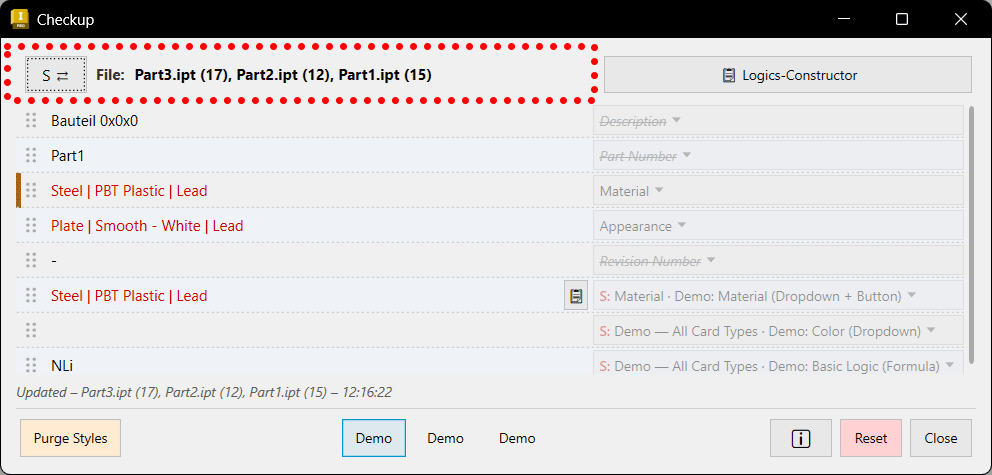

# Getting Started with Checkup — A Quick Visual Tour

Scroll through and watch the clips to see what Checkup does and where everything
lives. No setup knowledge needed.

> Looking for how to **install** it? See the [README](../README.md).
> Looking for the **technical** details? See the
> [Technical Design Document](CheckupAddin%20-%20Technical%20Design%20Document.md).
> Looking for a **plain-language list of every function**? Jump to the
> [Function Reference](#function-reference) further down this page.

---

## The Main Checkup Window

*The Main Addin Window Presents Users with a Maximum of 30 Rows which can be Sorted via Drag & Drop Handles.
Users can Add / Remove Rows from the Dropdown Menu on the Right. And Select, for the Row on which the Dropdown Menu
is Opened, any Value Present in the Object which is Selected in Inventor's Model Space / Model Browser.
The Addin either Lists a Single or Multiple Selected Objects. Within an Assembly (IAM) or a Part (IPT) it Lists the
Document itself if nothing is Selected.
At the Bottom of the Addin Window are three Preset Buttons Editable by Users through a Single Mouse Right Click (Context Menu).
Also on the Bottom Left is the "Purge Styles" Button which Cleans IAM / IPT / IDW.
On the Bottom Right is the "I" (Info) Button, the "Reset" Button and the "Close" Button.
At the Top Right is the "Logics-Constructor" Button Opening a Separate Window.
(see Info Windows for Further Information)*

---

## Logics-Constructor — Catalog Tab

*When Opening the Logics-Constructor Window from the Main Addin Window, Users will be Presented with the Option to
Switch via the "Catalogs" and "Capabilities" Tabs on the Top Left.
This Switches Views so Users can Create, Edit, Delete, Export, Import, Lock and Unlock Catalogs.
The Addin has Multiuser Workflow Rules Built in. This Means: when Catalogs / Capabilities are Stored on a UNC Path,
this is Automatically Detected and Sets a Locked State! When Users Unlock, the Catalog / Capability will be Migrated to
Local User Space and Set to Unlocked as a Safeguard. This is also the Intended Way for Updating Team-Managed Catalogs / Capabilities:
Unlock -> Edit -> Export to UNC Path to Replace the File (see Documentation).
For Example, the Next Day when Users Start Inventor, the Catalogs / Capabilities Read the Latest Data. Or, if they Migrated
Catalogs / Capabilities (through Unlocking) to their User Space, they can See that their Local Copy is Out of Date.
And they can Delete their Local Copy from within the Addin, which will Notify that a Restart of Inventor is Mandatory.*

---

## Logics-Constructor — Capabilities Tab

*When the "Capabilities" Tab is Active, Users will See Existing Capabilities in Groups. Each Group Represents one Special
Function which will be Listed in the Main Addin on the Dropdown Menu (the "S:" Entries). Each Group can be Named and
Rearranged via Drag & Drop.
At the Bottom is a Collapsible "Cards" Palette holding the Card Types Users can Add to the Active Group — Button, Dropdown,
Link, PairTransform, Prefix/Suffix, Search, MultiPick, Sort and Sync. A Single Click adds the Chosen Card to the Active Group.
On the Far Right is a Collapsible "Basic Logics" Panel holding Spreadsheet-Style Formula Functions (IF, LOOKUP, CONCATENATE,
ROUND and more). Clicking one adds a Basic Logic Card with the Function Skeleton Pre-Filled.
Cards and Basic Logics inside a Group Run from Top to Bottom, so Users can Reorder them to Control which Value Feeds the Next.
At the very Bottom is the Toolbar: on the Left the "+ Add Group" Button; on the Right the "I" (Info), ▲ (Up), ▼ (Down),
⧉ (Duplicate) and × (Delete) Buttons which Act on the Active Group or Card.*

---

## Function Reference

> **Work in Progress** — Annotated screenshots and detailed descriptions are
> being added. The outline below shows the planned structure; all section
> headings and numbered items are already in place.

A plain-language companion to the
[Technical Design Document](CheckupAddin%20-%20Technical%20Design%20Document.md):
the same feature set, explained for users instead of coders. Each window below
has **one annotated screenshot** — the numbered markers on the screenshot match
the numbered list underneath it. Where a short clip explains a step better than a
still image, an optional GIF can be added under the relevant item.

<!-- DRAFT SKELETON — brief seed descriptions only; expand the text in your own words.
     IMAGE PLACEHOLDERS (all are HTML comments, so nothing renders broken):
       • One SCREENSHOT per window — annotate it with numbered markers (1, 2, 3 …)
         that line up with the numbered list below it.
         Replace the comment with: 
       • Each list item also has an OPTIONAL detail-clip slot for a GIF, in case a
         single function needs its own animation. Delete the ones you do not use;
         add more wherever you like. -->

---

### The Main Checkup Window

<!-- SCREENSHOT — annotate with numbered markers matching the list below.
     Replace with:  -->

The numbers below correspond to the markers on the screenshot:

1. **The Row Grid** — Shows up to 30 rows of values from the part or assembly you
   are looking at. Drag the dotted handle on the left of any row to reorder it.
   <!-- optional clip →  -->
2. **The Field Selector (right-hand dropdown)** — Decides which value each row
   shows. It has a search box at the top, "Add Row" / "Remove Row" actions, a
   Favorites area you fill by right-clicking entries to pin them, and the full
   list of available values grouped by where they come from. Values that do not
   exist on the current object appear greyed out and struck through; special
   functions from the Logics-Constructor are tagged "S:" in red.
   <!-- optional clip →  -->
3. **Viewing and editing a value** — Each row's value field shows what was read
   from Inventor. Click it once to edit inline and write the new value straight
   back to the model. Right-click a value to copy it to the clipboard.
   <!-- optional clip →  -->
4. **Editing formulas (fx)** — Beyond plain values, you can edit iProperty
   expressions and parameter equations, so the underlying formula updates rather
   than just the displayed result.
   <!-- optional clip →  -->
5. **What Checkup reads (the source object)** — Reads the active part, the
   component(s) you select in an assembly, or — if nothing is selected — the open
   part or assembly document itself. You can select several parts at once.
   <!-- optional clip →  -->
6. **The document-name header** — Shows the file name of whatever is being read.
   When you select more than one object, all names are listed and the text turns
   red as a reminder that you are in multi-select. When multiple instances of the
   same component are selected in an assembly, a `(N)` counter appears next to the
   name — e.g. `Schraube_M8.ipt (6)`. Use the **view-mode button** on the left of the
   header (its label shows the current mode and a `⇄` arrow — `S ⇄`, `C ⇄`, `D ⇄`),
   or left-click the filename itself, to cycle through three display modes:
   - **Plain (S)** — filename + count (default)
   - **Compact (C)** — adds how many sub-assemblies contain this component, e.g. `(6, 2 IAM)`
   - **Detailed (D)** — groups by sub-assembly, e.g. `Baugruppe.iam > Schraube_M8.ipt (3)`;
     components directly in the top assembly are listed under the assembly's own name
   The selected mode is remembered between sessions (and resets to **S** when you press
   Reset). The header wraps to at most 2 lines (5 in Detailed) and then trims; hover
   over it to see the full text. Long row values follow the same 2-line rule.
   
7. **Presets** — The three buttons at the bottom store row layouts you use often.
   Right-click a preset to save the current layout into it, or to export and
   import layouts — letting you build a personal library and share it between
   machines.
   <!-- optional clip →  -->
8. **Style Purger** — The button at the bottom-left removes unused styles from the
   current part, assembly, or drawing in one click. (It does not save the file for
   you — save manually afterwards.)
   <!-- optional clip →  -->
9. **Info, Reset, Close and the status line** — The bottom-right buttons open the
   built-in help, reset the layout to defaults, and close the window. The small
   status line just above them reports the result of edits, purges, and refreshes.
   <!-- optional clip →  -->
10. **Automatic behaviors** — The grid keeps itself up to date when you switch
    documents or change your selection, follows Inventor's dark or light theme
    automatically, and displays German or English to match Inventor's language.

---

### The Logics-Constructor — Catalogs Tab

<!-- SCREENSHOT — annotate with numbered markers matching the list below.
     Replace with:  -->

The numbers below correspond to the markers on the screenshot:

1. **What a catalog is** — A named table of columns and rows that feeds the
   special functions — think of it as the lookup data behind a dropdown or a
   search.
2. **Creating and editing catalogs** — Create, rename, and delete catalogs, and
   edit their contents in a spreadsheet-style grid with copy/paste, fill-down, and
   insert/delete of rows and columns. Click a row-number to select the whole row;
   click a column-header body to select the whole column; hold Ctrl or Shift to
   add to or extend the selection. Right-click the selection to delete all chosen
   rows or columns in one step. Click the sort caret (⇅/▲/▼) in a column header
   to sort ascending or descending.
   <!-- optional clip →  -->
3. **Importing and exporting catalogs** — Share a catalog as a file and import one
   from elsewhere, so catalogs can move between machines or teammates.
   <!-- optional clip →  -->
4. **Lock / unlock and the multi-user workflow** — Catalogs stored on a network
   (UNC) path are detected automatically and shown as locked / read-only.
   Unlocking makes a personal local copy (the shared original is never changed).
   The intended way to update a team catalog is: Unlock → Edit → Export back to
   the network path. When a shared catalog is newer than your local copy, Checkup
   offers an "Update" button.
   <!-- optional clip →  -->

---

### The Logics-Constructor — Capabilities Tab

<!-- SCREENSHOT — annotate with numbered markers matching the list below.
     Replace with:  -->

The numbers below correspond to the markers on the screenshot:

1. **What a capability and a group are** — A capability set holds one or more
   Groups. Each Group is one special function and shows up as a single "S:" entry
   in the main window's Field Selector. The Group's name becomes that entry's
   label.
2. **Managing groups** — Add, name, reorder (drag and drop, or the ▲ / ▼ buttons),
   duplicate, and delete groups. Each group gets its own accent color for easy
   visual tracking.
   <!-- optional clip →  -->
3. **The Cards palette** — Cards are the building blocks you add to a group from
   the palette at the bottom. A single click adds the chosen card to the active
   group:
   <!-- optional clip →  -->
    - **Button** — adds a button that opens the Catalog Picker window to choose an entry.
    - **Dropdown** — offers a fixed list of catalog choices directly in the row.
    - **Link** — pulls its value from another (partner) field.
    - **PairTransform** — looks up an input value and replaces it with a paired output value from a catalog.
    - **Prefix/Suffix** — adds (or removes) fixed text before or after a value.
    - **Search** — type-ahead search against a catalog's entries.
    - **MultiPick** — lets you pick several values at once, kept in sync with a companion field.
    - **Sort** — sorts multi-part values using a catalog and a separator.
    - **Sync** — keeps a companion field in step with this one.
4. **Basic Logics** — The collapsible panel on the right holds spreadsheet-style
   formula functions you can drop into a group. Clicking one adds a card with the
   formula skeleton pre-filled. Examples:
   <!-- optional clip →  -->
    - **IF / ELSE** — choose a value based on a condition.
    - **LOOKUP** — fetch a value from a catalog by key.
    - **CONCATENATE / JOIN** — combine several values into one.
    - **ROUND, ABS, VALUE** — number handling.
    - **LEFT, RIGHT, MID, TRIM, UPPER, LOWER, REPLACE** — text handling.
    - … and more — the panel lists the full set.
5. **Card order and the toolbar** — Cards and Basic Logics run from top to bottom,
   so reorder them to control which value feeds the next. The toolbar at the
   bottom has "+ Add Group" on the left and Info (ℹ), Up (▲), Down (▼), Duplicate
   (⧉) and Delete (×) on the right, acting on whichever Group or Card is active.

---

### Across All Windows

#### The Catalog Picker Window

<!-- SCREENSHOT / clip →  -->

Opened from a Button card, this full window lets you browse a catalog and pick an
entry to drop into the row.

#### Built-in Info Buttons

Every window has its own "i" (Info) button with a short quick-guide built right
in — open it any time for a refresher on that window.

---

> **Want more?** For the full technical depth, see the
> [Technical Design Document](CheckupAddin%20-%20Technical%20Design%20Document.md).
