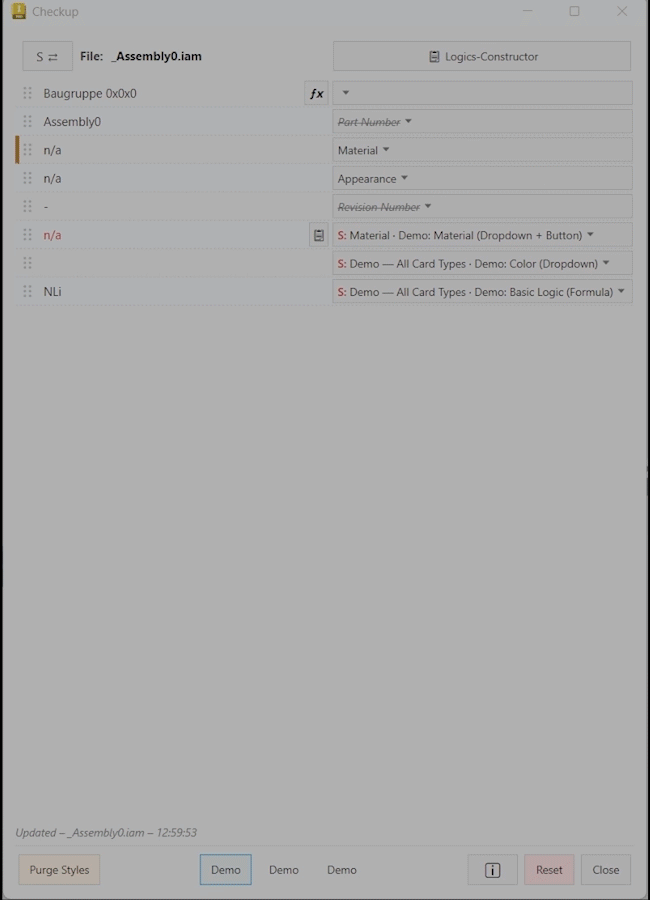
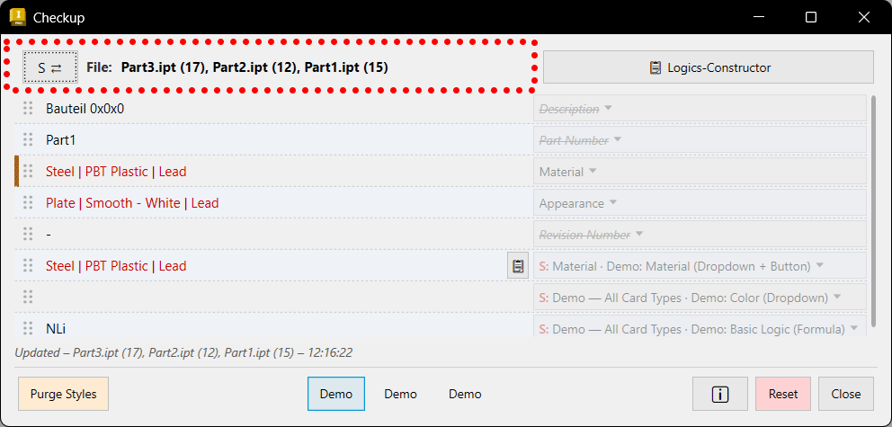

# Earlier Designs

Screenshots and clips of earlier Checkup versions, kept for reference. Each folder is named after the last
release that looked like this.

## v0.15.0 (up to 2026-06)

The main window before v0.16.0: three fixed Preset Buttons centred in the bottom bar, and the
built-in "Purge Styles" button on the bottom left (replaced by "Run iLogic Rule" in v0.16.0).

